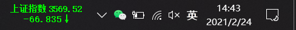
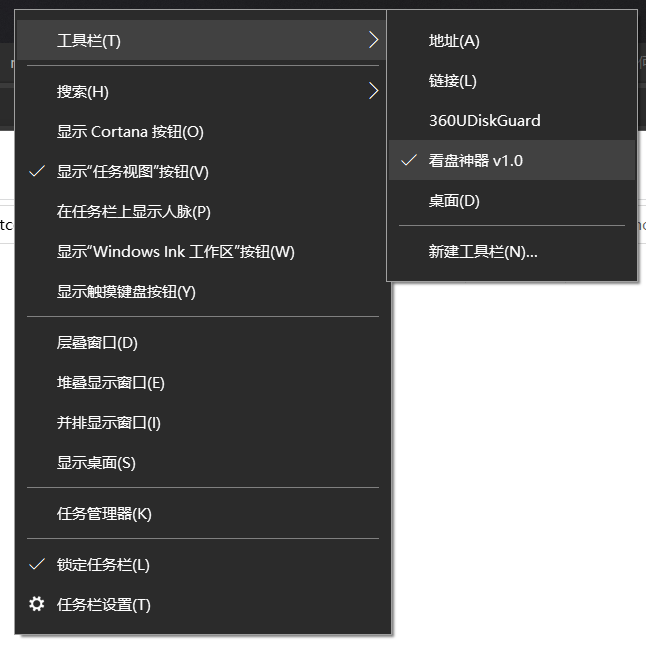
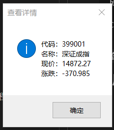
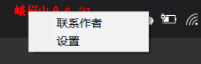
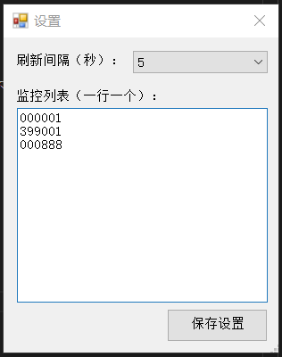

## StockWatcher

## 一个简单实用的股票看盘工具，windows 任务栏工具，原作者@mrhuo。

## 预览
|Preview|Preview|Preview|
|:---:|:---:|:---:|
||||
||||

<br>

## 安装

1、必须安装 .NET framework 4.5.2 或更高版本 [跳转下载](https://dotnet.microsoft.com/zh-cn/download/dotnet-framework/net452)。

2、下载发行版并解压 [StockWatcher](https://github.com/scliu01/StockWatcher/releases) 。

3、在文件夹中右键 `\StockWatcher-1.1\src\StockWatcher\bin\Debug` 用 **管理员权限** 打开cmd执行：StockWatcher.exe i

> 注意，一定要管理员权限打开，否则无法安装或卸载。任务栏工具相当于给 `explorer.exe` 进程安装插件，所以需要管理员权限才可操作。安装杀毒软件的话，可能会报无权限操作，允许即可。

4、执行如下命令：

#### 卸载软件

在文件夹cmd中执行 `StockWatcher.exe u` 用 **管理员权限** 打开，之后关闭窗口即可。

<br>

## 使用

- 如果股票数据获取异常，可能是股票代码没有正确的设置 sz sh 前缀，需要前往 ```C:\temp_stock_watcher\stock_watcher_config.ini``` 编辑文本，更改为正确的前缀。

- 如果只想显示一只股票，写入两行相同的代码即可。

- 双击任务栏盘面信息，显示当前股票信息。

- 右键任务栏盘面信息，出现操作菜单。
